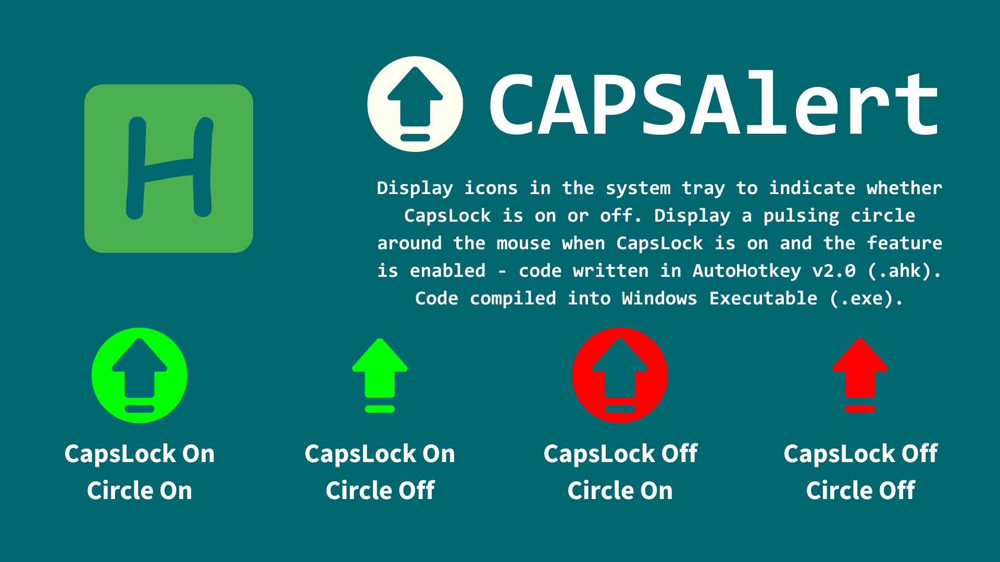

# CAPSAlert

Display icons in the system tray to indicate whether CapsLock is on or off. Display a pulsing circle around the mouse when CapsLock is on and the feature is enabled - code written in AutoHotkey v2.0 (`.ahk`). Code compiled into Windows Executable (`.exe`).

- Icons displayed in the `System Tray`.
- Icons display based on:
  - CapsLock on or off
  - Circle display toggled on or off
- Made with AutoHotkey (`.ahk`)
- Compiled into Windows Executable (`.exe`)

## Installation

There are two methods to install. 

### **Method 1: The AutoHotkey file (`.ahk`)**
- Make sure you have AutoHotkey v2.0 installed on your computer. If not, download [here](https://www.autohotkey.com/v2/).
- Download the AutoHotkey file [here](CAPSAlert.ahk).
- Double-click to run it using AutoHotkey.

### **Method 2: The Windows Executable file (`.exe`)**
- Download the Windows Executable [here](CAPSAlert.exe?raw=true).
- Double-click it to run it. If blocked by Windows Defender, click 'More' then 'Run Anyway'.

### **Show system tray icon**
- In the bottom-right corner of your screen, near the time and Wi-Fi icons, click the up arrow (˄).
- Locate the icon for your file or application in the pop-up tray.
- Drag the icon from the pop-up tray into the main area next to the time and Wi-Fi icons.
- Windows will now keep this icon visible in the system tray for easy access.

### **Auto-Start on Boot (Optional)**
To run the script automatically when Windows starts:

1. Press `Win + R` to open the Run dialogue.
2. Type `shell:startup` and press Enter. This opens your Startup folder.
3. Copy the `.ahk` or `.exe` file into this folder
4. **Remember to always keep the file in the folder**

#### **Now it will run on startup automatically!**

## Assets

- [Original code (`.ahk`)](CAPSAlert.ahk?raw=true)
- [Windows Executable (`.exe`)](CAPSAlert.exe?raw=true)
- [Icons (.ico)](../../)
- [Icons (.png)](Icons)

## Details

## License

MIT License

Copyright (c) 2025 The ABCs of Coding

Permission is hereby granted, free of charge, to any person obtaining a copy
of this software and associated documentation files (the "Software"), to deal
in the Software without restriction, including without limitation the rights
to use, copy, modify, merge, publish, distribute, sublicense, and/or sell
copies of the Software, and to permit persons to whom the Software is
furnished to do so, subject to the following conditions:

The above copyright notice and this permission notice shall be included in all
copies or substantial portions of the Software.

THE SOFTWARE IS PROVIDED "AS IS", WITHOUT WARRANTY OF ANY KIND, EXPRESS OR
IMPLIED, INCLUDING BUT NOT LIMITED TO THE WARRANTIES OF MERCHANTABILITY,
FITNESS FOR A PARTICULAR PURPOSE AND NONINFRINGEMENT. IN NO EVENT SHALL THE
AUTHORS OR COPYRIGHT HOLDERS BE LIABLE FOR ANY CLAIM, DAMAGES OR OTHER
LIABILITY, WHETHER IN AN ACTION OF CONTRACT, TORT OR OTHERWISE, ARISING FROM,
OUT OF OR IN CONNECTION WITH THE SOFTWARE OR THE USE OR OTHER DEALINGS IN THE
SOFTWARE.

---

*Product of the ABCs of Coding*

